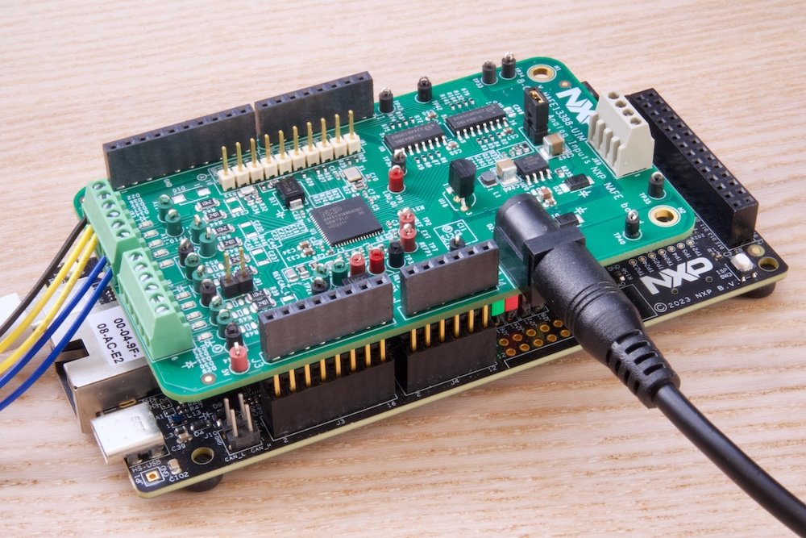
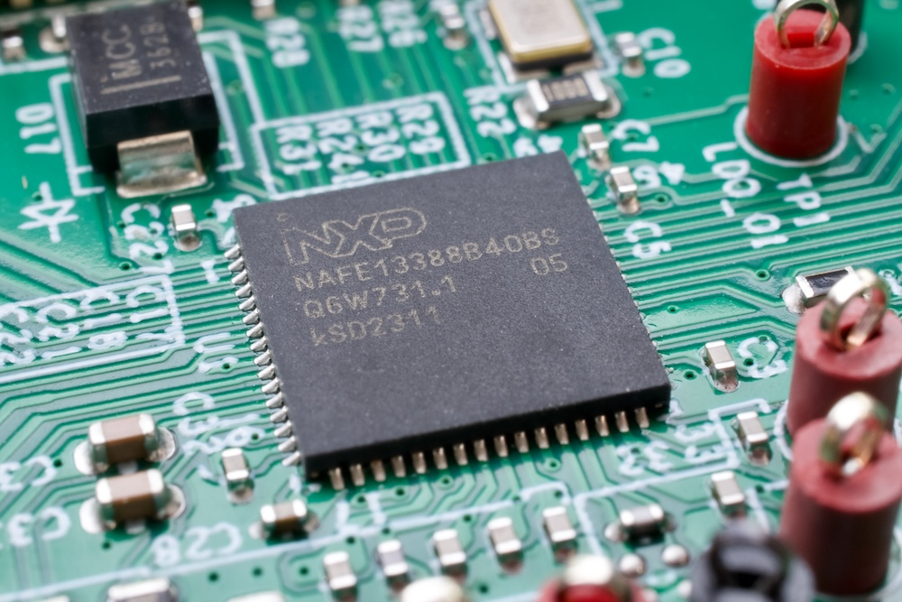

# UIM_NAFE13388_FRDM_MCX

## What is this?   
NXP Analog-Front-End chip: NAFE13388 class driver and sample code for MCX series microcontrollers.  
This sample code works on those evaluation boards: **[X-NAFE13388-UIM](https://www.nxp.com/design/design-center/development-boards-and-designs/NAFE13388-UIM)** and FRDM-MCX.  
Supported MCU boards are..
- [FRDM-MCXN947](https://www.nxp.com/design/design-center/development-boards-and-designs/FRDM-MCXN947)
- [FRDM-MCXN236](https://www.nxp.com/design/design-center/development-boards-and-designs/FRDM-MCXN236)
- [FRDM-MCXA156](https://www.nxp.com/design/design-center/development-boards-and-designs/FRDM-MCXA156)
- [FRDM-MCXA153](https://www.nxp.com/design/design-center/development-boards-and-designs/FRDM-MCXA153)
- [FRDM-MCXC444](https://www.nxp.com/design/design-center/development-boards-and-designs/FRDM-MCXC444)

> **Note**  
> The FRDM-MCXA156 and FRDM-MCXA153 sample code are available for basic demo only

> **Note**  
> The **FRDM-MCXA156** board needs modification to connect X-NAFE13388-UIM. In default setting, the SPI pins on D10 and D11 are not connected to Arduino shield connector. **Change jumper settings on R59 and R60 to connect those pins (short pins 2-3)**.

The sample code can be build on **[MCUXpresso](https://www.nxp.com/design/design-center/software/development-software/mcuxpresso-software-and-tools-/mcuxpresso-integrated-development-environment-ide:MCUXpresso-IDE)**. 

  
*X-NAFE13388-UIM on FRDM-MCXN947*

*Analog-Front-End chip: NAFE13388*
